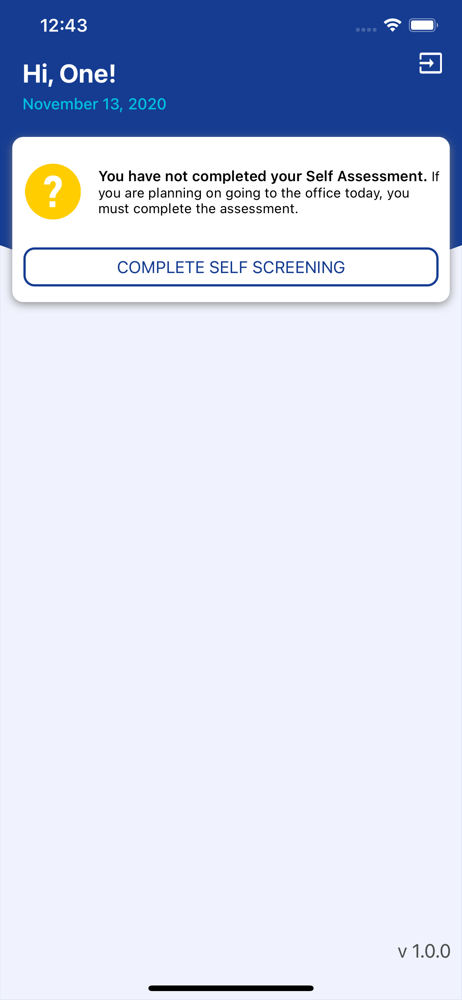

# swift
A visual portfolio of my latest Swift iOS projects. 📱

# Schools Self Screenin‪g‬ 

Use the Schools Self Screening App to help fight the spread of COVID-19 by having your employees submit a self screening before entering the workplace.

I'm extremely pleased with how the project came out. I'm particularly proud of the app's animation, UI design, and easily-extended architecture. Sakura was built with Xcode and written entirely in Swift 5; it utilizes Auto Layout for UI design, and makes extensive use of both UIView animations and CAEmitterLayers.  

&nbsp;&nbsp;&nbsp;&nbsp;&nbsp;&nbsp;&nbsp;&nbsp;&nbsp;&nbsp;

