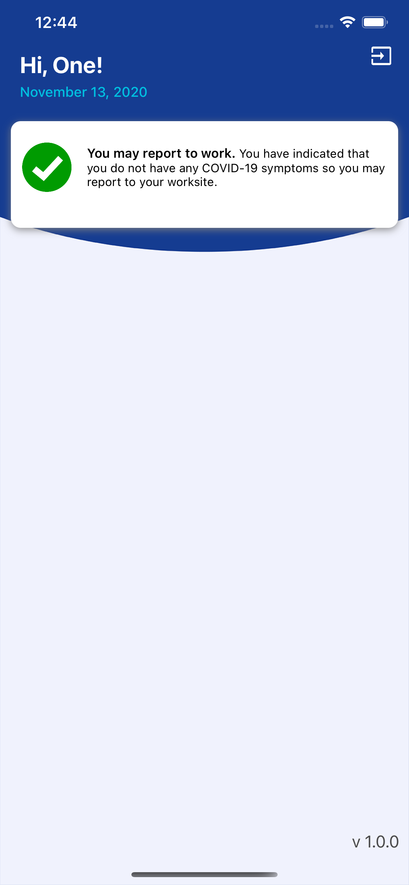

# App portfolio
A visual portfolio of my latest Swift iOS projects. 📱

# Schools Self Screenin‪g‬ 

Use the Schools Self Screening App to help fight the spread of COVID-19 by having your employees submit a self screening before entering the workplace.

Self Screenin‪g‬ was built with Xcode and written entirely in Swift 5; it utilizes Auto Layout for UI design, and makes extensive use of both UIView animations and CAEmitterLayers. App uses Alamofire for the networking layer and Crashlytics to analyze app crash reports.

App used every day by hundreds of California state employees and schools.

&nbsp;&nbsp;&nbsp;&nbsp;&nbsp;&nbsp;&nbsp;&nbsp;&nbsp;&nbsp;&nbsp;&nbsp;&nbsp;&nbsp;&nbsp;&nbsp;&nbsp;&nbsp;&nbsp;&nbsp;

[AppStore](https://apps.apple.com/app/id1540141318)  since Nov, 2020

# CA Dashboar‪d‬

The Dashboard is California’s new accountability system and helps parents and educators identify strengths and areas for improvement. Through the Dashboard, California reports how districts, schools (including alternative schools serving high-risk students), and student groups are performing across state measures and responding to local indicator measures.

#### iPhone

&nbsp;&nbsp;&nbsp;&nbsp;&nbsp;&nbsp;&nbsp;&nbsp;&nbsp;&nbsp;&nbsp;&nbsp;&nbsp;&nbsp;&nbsp;&nbsp;&nbsp;&nbsp;&nbsp;&nbsp;

#### and iPad 

[AppStore](https://apps.apple.com/app/id1469947640)  since Jun, 2019

# EDJOIN Intervie‪w‬ 

The Dashboard is California’s new accountability system and helps parents and educators identify strengths and areas for improvement. Through the Dashboard, California reports how districts, schools (including alternative schools serving high-risk students), and student groups are performing across state measures and responding to local indicator measures.

#### iPhone

&nbsp;&nbsp;&nbsp;&nbsp;&nbsp;&nbsp;&nbsp;&nbsp;&nbsp;&nbsp;

#### and iPad 

&nbsp;&nbsp;&nbsp;&nbsp;&nbsp;&nbsp;&nbsp;&nbsp;&nbsp;&nbsp;

[AppStore](https://apps.apple.com.com/us/app/edjoin-interview/id434730011)

## Thanks for stopping by!

# Contact Info:

- Email: hiAlexSosnov@gmail.com
- LinkedIn: [asosnov](https://www.linkedin.com/in/alexander-sosnov/)
