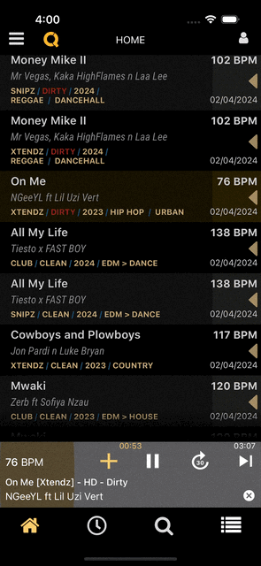
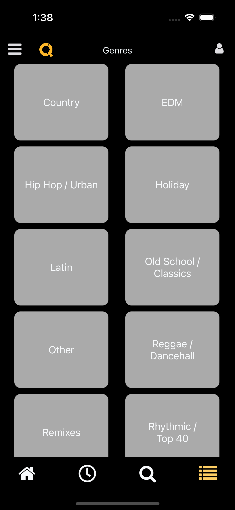
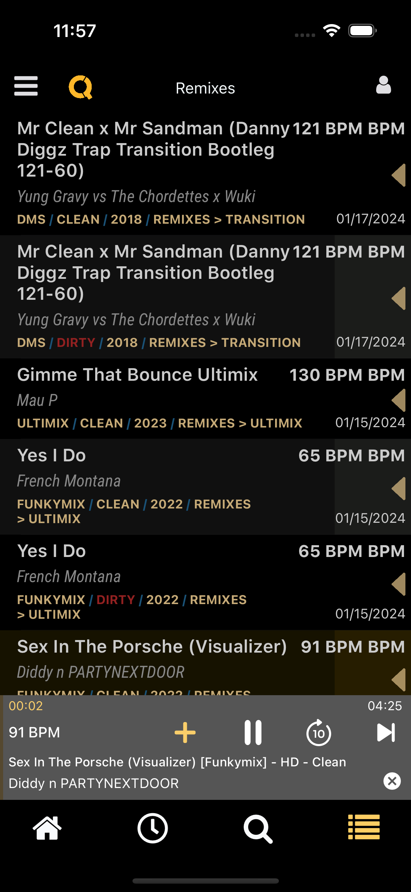
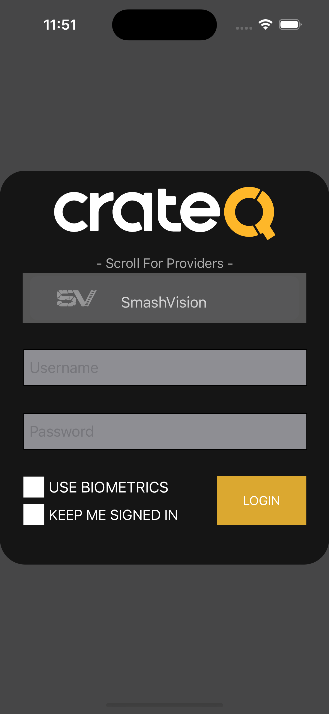
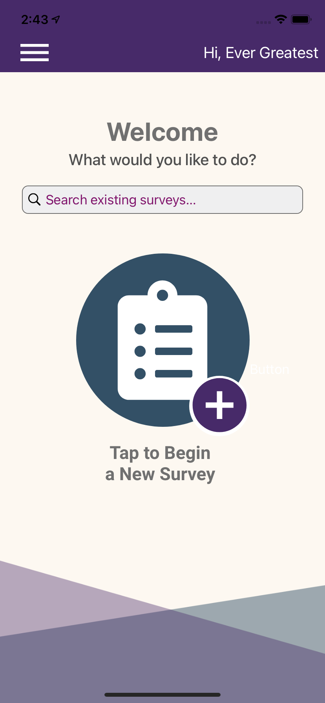
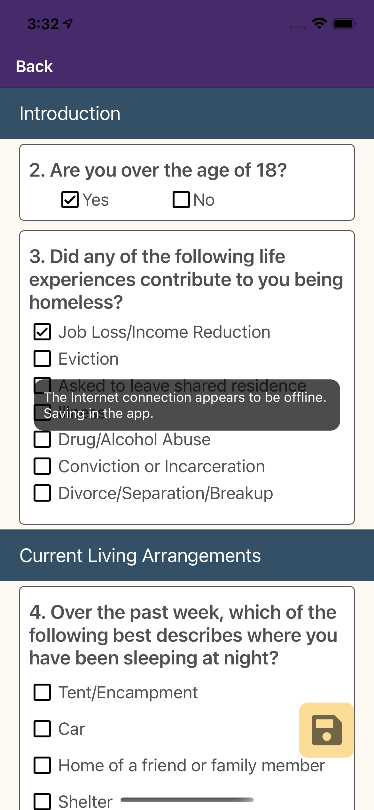
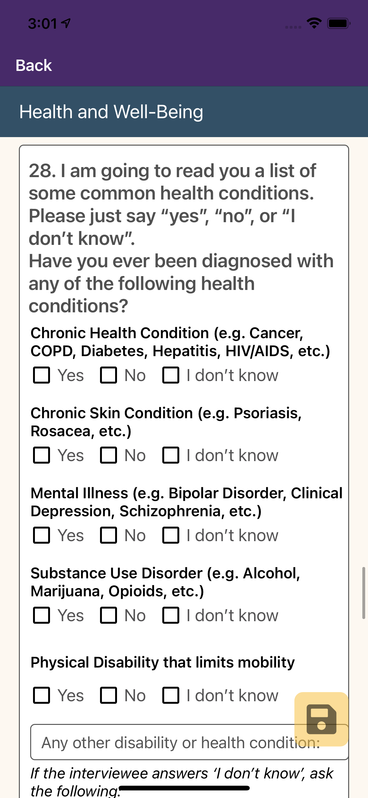
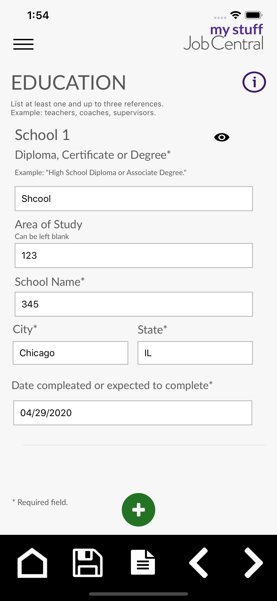
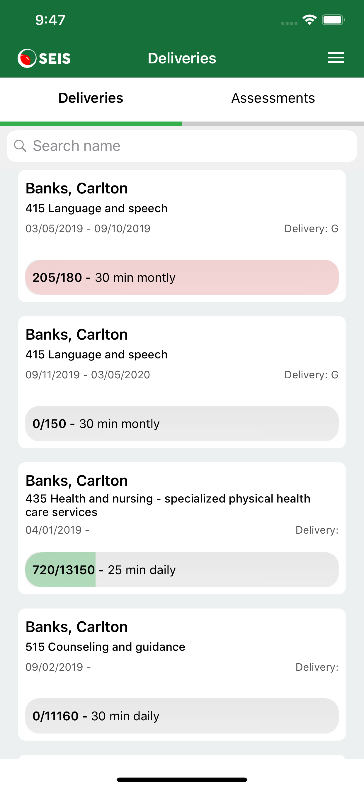

# App portfolio
A visual portfolio of my latest Swift iOS projects. 📱

&nbsp;&nbsp;&nbsp;&nbsp;&nbsp;&nbsp;&nbsp;&nbsp;&nbsp;&nbsp;

# CrateQ 

Easily discover new music and queue your upcoming downloads from CrateQ mobile app.
Your record pool will sync their queue page with our desktop and mobile apps.

* Fully re-build this app, added new features 

<em>Technology used:</em>   
Swift, Git, Autolayout, Programmatic UI, Persistent data, LocalAuthentication, Hero, CoreMedia, AVKit, AVFoundation, MediaPlayer

<a href="https://apps.apple.com/us/app/crateq/id1513483202" target="_blank">

&nbsp;&nbsp;&nbsp;&nbsp;&nbsp;&nbsp;&nbsp;&nbsp;&nbsp;&nbsp;&nbsp;&nbsp;&nbsp;&nbsp;&nbsp;&nbsp;&nbsp;&nbsp;&nbsp;&nbsp;

# HomeBound 

App developed for the city of Stockton, CA. This app is intended for existing city outreach volunteers, staff, and personnel who currently use existing paper surveys, as another efficient means to collect this critical data in order to effectively serve the homeless population. 
HomeBound App has offline capabilities, stores gathered surveys on the device. Surveys can be submitted at any time once internet connection is back.
Core location and GoogleMaps API used to capture exact location of where survey takes place. Camer or gallery can be attached to any survey.

App used every day by hundreds of California state employees and schools.

* Fully build this app

<em>Technology used:</em>   
Swift, Git, Autolayout, Programmatic UI, Persistent data, GoogleMaps API, MapKit, CoreLocation, Camera.

<a href="https://apps.apple.com/us/app/project-homebound/id1571378906" target="_blank">

&nbsp;&nbsp;&nbsp;&nbsp;&nbsp;&nbsp;&nbsp;&nbsp;&nbsp;&nbsp;&nbsp;&nbsp;&nbsp;&nbsp;&nbsp;&nbsp;&nbsp;&nbsp;&nbsp;&nbsp;

# Schools Self Screenin‪g‬ 

Use the Schools Self Screening App to help fight the spread of COVID-19 by having your employees submit a self screening before entering the workplace.

Self Screenin‪g‬ was built with Xcode and written entirely in Swift 5; it utilizes Auto Layout for UI design, and makes extensive use of both UIView animations and CAEmitterLayers. App uses Alamofire for the networking layer and Crashlytics to analyze app crash reports.

App used every day by hundreds of California state employees and schools.

* Fully build this app

<em>Technology used:</em>   
Swift, Git, Autolayout, One Signal Push Notifications, Programmatic UI

<a href="https://apps.apple.com/app/id1540141318" target="_blank">

&nbsp;&nbsp;&nbsp;&nbsp;&nbsp;&nbsp;&nbsp;&nbsp;&nbsp;&nbsp;&nbsp;&nbsp;&nbsp;&nbsp;&nbsp;&nbsp;&nbsp;&nbsp;&nbsp;&nbsp;

# CA Dashboar‪d‬

The Dashboard is California’s new accountability system and helps parents and educators identify strengths and areas for improvement. Through the Dashboard, California reports how districts, schools (including alternative schools serving high-risk students), and student groups are performing across state measures and responding to local indicator measures.

* Fully build this app

<em>Technology used:</em>   
Swift, Git, Autolayout, Programmatic UI, MapKit, Firebase/Crashlytic

<a href="https://apps.apple.com/app/id1469947640" target="_blank">

#### iPhone

&nbsp;&nbsp;&nbsp;&nbsp;&nbsp;&nbsp;&nbsp;&nbsp;&nbsp;&nbsp;&nbsp;&nbsp;&nbsp;&nbsp;&nbsp;&nbsp;&nbsp;&nbsp;&nbsp;&nbsp;

#### and iPad 

# EDJOIN Intervie‪w‬ 

The EDJOIN Interview app is a tool for California public education agencies who use EDJOIN and EDJOIN-Admin for online employee recruitment and application tracking. This app will offer new features such as facilitating the interview process.

* Fully rewrote this app in Swift, was buld with Flutter

<em>Technology used:</em>   
Swift, Git, Autolayout, Programmatic UI, Firebase/Crashlytic, Custom drop downs 

<a href="https://apps.apple.com/us/app/edjoin-interview/id434730011" target="_blank">

#### iPhone

&nbsp;&nbsp;&nbsp;&nbsp;&nbsp;&nbsp;&nbsp;&nbsp;&nbsp;&nbsp;

#### and iPad 

&nbsp;&nbsp;&nbsp;&nbsp;&nbsp;&nbsp;&nbsp;&nbsp;&nbsp;&nbsp;

# My Stuff Job Centra‪l‬

The My Stuff Job Central app is a tool for beginning job seekers. The app allows you to input your information and easily create a resume for future employers. This app is a resource of the California Department of Education's California Career Resource Network.

* Fully build this app

<em>Technology used:</em>   
Swift, Git, Autolayout, Programmatic UI, Firebase/Crashlytic

<a href="https://apps.apple.com/us/app/my-stuff-job-central/id1469462748" target="_blank">

&nbsp;&nbsp;&nbsp;&nbsp;&nbsp;&nbsp;&nbsp;&nbsp;&nbsp;&nbsp;&nbsp;&nbsp;&nbsp;&nbsp;&nbsp;&nbsp;&nbsp;&nbsp;&nbsp;&nbsp;

# SEIS Tracker

The SEISTracker app allows service providers to quickly and easily document the delivery of their services, on the go. Most fields on the delivery page are prepopulated from the students IEP, to alleviate unneeded clicking. The deliveries entered into SEISTracker will update SEIS instantaneously. View the chart to see the total minutes that have been delivered for each student.

* Added few sections new app sections to the existng app, added features, expanding it funcitonality 2x times. 

<em>Technology used:</em>   
Swift, Git, Autolayout, Programmatic UI, Firebase/Crashlytic, Keychain

<a href="https://apps.apple.com/us/app/seis-tracker/id1437211511" target="_blank">

#### iPhone

&nbsp;&nbsp;&nbsp;&nbsp;&nbsp;&nbsp;&nbsp;&nbsp;&nbsp;&nbsp;

#### and iPad 

&nbsp;&nbsp;&nbsp;&nbsp;&nbsp;&nbsp;&nbsp;&nbsp;&nbsp;&nbsp;

# Strong Start

The Strong Start app is an information tool to help you become familiar with our department. Stay in the know with upcoming events, search staff members with our contact directory, browse helpful resources and more.

* Fully build this app

<em>Technology used:</em>   
Swift, Git, Autolayout, Programmatic UI, Firebase/Crashlytic

<a href="https://apps.apple.com/us/app/strong-start/id1517861555" target="_blank">

#### iPhone

&nbsp;&nbsp;&nbsp;&nbsp;&nbsp;&nbsp;&nbsp;&nbsp;&nbsp;&nbsp;&nbsp;&nbsp;&nbsp;&nbsp;&nbsp;&nbsp;&nbsp;&nbsp;&nbsp;&nbsp;

#### and iPad 

# CCTC Credential Tracke‪r‬

The California Center on Teaching Careers is tasked with helping to eliminate the teacher shortage in California. To that end, we have created the Credential Tracker App. Our initial effort is to help those teacher candidates that are currently on a provisional intern permit to teach.

* Rewrote the entire codebase of this app

<em>Technology used:</em>   
Swift, Git, Autolayout, Programmatic UI, Firebase/Crashlytic, In-App Messaging

<a href="https://apps.apple.com/app/id1349924190" target="_blank">

#### iPhone and iPad

&nbsp;&nbsp;&nbsp;&nbsp;&nbsp;&nbsp;&nbsp;&nbsp;&nbsp;&nbsp;&nbsp;&nbsp;&nbsp;&nbsp;&nbsp;&nbsp;&nbsp;&nbsp;&nbsp;&nbsp;

# Allo Community

App where friends and neighbors help each other out!

Social Networking for parents
* Build test and deploy app to the AppStore
* MapKit functionality, filters, views
* NewsFeed implementation, server library, UI/UX

<em>Technology used:</em>   
Swift, Git, Autolayout, CoreData AWSAmazonservices, MapKit

[Allo's website](https://www.allocommunity.com) 

#### iPhone only

&nbsp;&nbsp;&nbsp;&nbsp;&nbsp;&nbsp;&nbsp;&nbsp;&nbsp;&nbsp;&nbsp;&nbsp;&nbsp;&nbsp;&nbsp;

## Thanks for stopping by!

# Contact Info:

- Email: hiAlexSosnov@gmail.com
- LinkedIn: [Alex Sosnov](https://www.linkedin.com/in/alexander-sosnov/)
